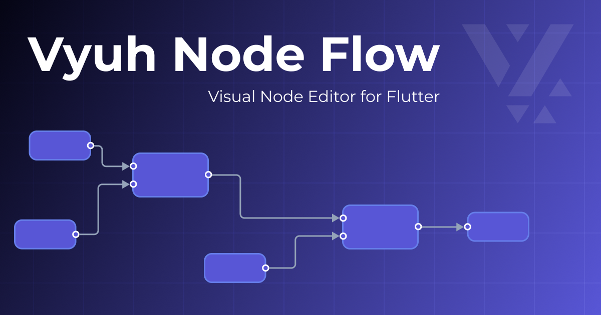

# Vyuh Node Flow



A flexible, high-performance node-based flow editor for Flutter applications, inspired by React Flow. This monorepo
contains the core library and demo application.

<p align="center">
  <a href="https://pub.dev/packages/vyuh_node_flow">
    
  </a>
  <a href="https://opensource.org/licenses/MIT">
    
  </a>
  <a href="https://flow.demo.vyuh.tech">
    
  </a>
</p>


## 📦 Packages

This repository is organized as a Dart workspace with the following packages:

### [`vyuh_node_flow`](./packages/vyuh_node_flow)

The core Flutter package providing the node-based flow editor functionality.

**Features:**

- High-performance reactive rendering with MobX
- Type-safe node data with generics
- Fully customizable themes for nodes, connections, and ports
- Flexible port system with multiple shapes and positions
- Annotations (sticky notes, markers, groups)
- Built-in minimap for navigation
- Comprehensive keyboard shortcuts
- Multiple connection styles (bezier, smoothstep, straight, step)
- Read-only viewer mode
- JSON serialization for saving/loading flows
- Auto-layout algorithms (grid, hierarchical, alignment, distribution)

**Installation:**

```yaml
dependencies:
  vyuh_node_flow: ^0.2.5
```

### [`demo`](./packages/demo)

A comprehensive demo application showcasing all features of the Vyuh Node Flow editor.

**Includes:**

- Interactive workbench with full editor controls
- Multiple example workflows (manufacturing, healthcare, IoT, etc.)
- Theme customization controls
- Layout and alignment tools
- Connection validation examples
- Annotation demonstrations

**Try it online:** [🚀 Live Demo](https://flow.demo.vyuh.tech)


## 🚀 Getting Started

### Prerequisites

- Flutter SDK 3.32.0 or higher
- Dart SDK 3.9.0 or higher

### Development Setup

This project uses [Melos](https://melos.invertase.dev/) for workspace management.

1. **Clone the repository:**
   ```bash
   git clone https://github.com/vyuh-tech/vyuh_node_flow.git
   cd vyuh_node_flow
   ```

2. **Install dependencies:**
   ```bash
   dart pub get
   ```

3. **Bootstrap the workspace:**
   ```bash
   dart run melos bootstrap
   ```

4. **Run the demo:**
   ```bash
   cd packages/demo
   flutter run -d chrome
   ```


## Documentation

- [Package Documentation](./packages/vyuh_node_flow/README.md)
- [API Reference](https://pub.dev/documentation/vyuh_node_flow/latest/)
- [Live Demo](https://flow.demo.vyuh.tech)


## 🤝 Contributing

Contributions are welcome! Please feel free to submit a Pull Request.

1. Fork the repository
2. Create your feature branch (`git checkout -b feature/amazing-feature`)
3. Commit your changes (`git commit -m 'Add some amazing feature'`)
4. Push to the branch (`git push origin feature/amazing-feature`)
5. Open a Pull Request


## License

This project is licensed under the MIT License - see the [LICENSE](LICENSE) file for details.

---

<p align="center">
  Made with ❤️ by the <a href="https://vyuh.tech">Vyuh Team</a>
</p>
