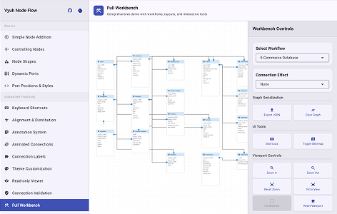

import { Card, Cards } from 'fumadocs-ui/components/card';
import { Callout } from 'fumadocs-ui/components/callout';
import { MediaPlaceholder } from '@/components/media-placeholder';
import {
  GitHubShield,
  PubShield,
  LicenseShield,
  IssuesShield,
  ShieldsGroup,
} from '@/components/shields';
import {
  Zap,
  ShieldCheck,
  Palette,
  Plug,
  Sparkles,
  GitBranch,
  StickyNote,
  Map,
  Keyboard,
  Eye,
  FileJson,
  Grid3x3,
  Hand,
} from 'lucide-react';

<ShieldsGroup>
  <GitHubShield repo="vyuh-tech/vyuh_node_flow" />
  <PubShield package="vyuh_node_flow" />
  <LicenseShield license="MIT" />
  <IssuesShield repo="vyuh-tech/vyuh_node_flow" />
</ShieldsGroup>

**Vyuh Node Flow** is a flexible, high-performance node-based flow editor for
Flutter applications, inspired by React Flow. It's great for building visual
programming interfaces, workflow editors, interactive diagrams, and data
pipelines.


## Try the Live Demo

Experience Vyuh Node Flow in action! The live demo showcases all key features
including node creation, drag-and-drop connections, custom theming, annotations,
minimap, and more.

<Callout type="info" title={'Launch Demo'}>

Try creating nodes, connecting them, exploring themes, and all interactive
features!

[](https://flow.demo.vyuh.tech)

</Callout>

## Key Features

<Cards>
  <Card icon={<Zap />} title="High Performance">
    Reactive, optimized rendering for smooth interactions on an infinite canvas
  </Card>
  <Card icon={<ShieldCheck />} title="Type-Safe Node Data">
    Generic type support for strongly-typed node data with excellent pattern
    matching capabilities using sealed classes
  </Card>
  <Card icon={<Palette />} title="Fully Customizable">
    Comprehensive theming system for nodes, connections, ports and backgrounds.
    Style everything to match your brand
  </Card>
  <Card icon={<Plug />} title="Flexible Ports">
    Multiple port shapes (circle, square, diamond, triangle, capsule, none) with
    customizable positions, offsets, and multi-connection support. Full
    connection validation capabilities. Create custom port shapes by extending
    the base class.
  </Card>
  <Card icon={<Sparkles />} title="Connection Animation Effects">
    Built-in effects including FlowingDash (marching ants), Particle (moving
    dots), GradientFlow (smooth colors), and Pulse (breathing). Create custom
    effects by extending the base class.
  </Card>
  <Card icon={<GitBranch />} title="Connection Styles">
    Multiple connection path styles: bezier curves for smooth flows, step &
    smoothstep for clean right angles, straight lines for direct paths. Create
    custom connection paths by extending the base class.
  </Card>
  <Card icon={<StickyNote />} title="Annotations">
    Add sticky notes, labels, and custom overlays to enhance your flow diagrams
    with contextual information
  </Card>
  <Card icon={<Map />} title="Built-in Minimap">
    Navigate complex flows with ease using the interactive minimap that shows
    your entire canvas at a glance
  </Card>
  <Card icon={<Keyboard />} title="Keyboard Shortcuts">
    Full keyboard support for power users with customizable shortcuts for common
    operations
  </Card>
  <Card icon={<Eye />} title="Read-Only Viewer">
    Display flows without editing capabilities - perfect for presentations and
    documentation
  </Card>
  <Card icon={<FileJson />} title="Serialization">
    Save and load flows from JSON with type-safe deserialization for persisting
    your work
  </Card>
  <Card icon={<Grid3x3 />} title="Grid Styles">
    Choose from lines, dots, cross, hierarchical (major/minor), or no grid.
    Configurable size, color, and snap-to-grid functionality for precise
    alignment. Create custom grid styles by extending the base class.
  </Card>
  <Card icon={<Hand />} title="Interactive Features">
    Full interaction support: drag nodes, create connections, pan canvas, zoom
    (wheel/pinch), multi-select, delete, fit to view, and more
  </Card>
</Cards>

## Visual Gallery

<div className="grid grid-cols-1 md:grid-cols-2 gap-4 my-6">
  <MediaPlaceholder
    type="video"
    title="Editor in Action"
    description="Video showing core interactions: creating nodes via drag-drop or context menu, connecting ports with smooth drag gestures, panning canvas with scroll/drag, zooming with pinch/wheel, multi-select with rectangle or shift-click, deleting with keyboard."
  />
  <MediaPlaceholder
    type="image"
    title="Dark Theme"
    description="Complex workflow in dark theme showing 8-10 connected nodes with various types (start, process, condition, end), multiple connection paths, minimap visible in corner, demonstrating rich visual hierarchy."
  />
  <MediaPlaceholder
    type="image"
    title="Light Theme with Custom Styling"
    description="Same workflow in light theme with custom node colors, branded styling, different port shapes (circle, diamond, square), and styled connections with arrows and labels."
  />
  <MediaPlaceholder
    type="animation"
    title="Connection Effects"
    description="Animated GIF showcasing four connection effects side-by-side: FlowingDash (marching ants), Particle (moving dots along path), GradientFlow (smooth color transition), and Pulse (breathing/glowing effect)."
  />
</div>

## Perfect For Building

Vyuh Node Flow is ideal for developers creating:

<Cards>
  <Card title="Data Pipeline Builders">
    Create visual ETL (Extract, Transform, Load) tools and data processing
    workflows
  </Card>
  <Card title="Workflow Automation">
    Build no-code/low-code workflow editors for business process automation
  </Card>
  <Card title="State Machines">
    Design visual state machine editors for game logic and application flows
  </Card>
  <Card title="Decision Trees">
    Implement interactive decision tree builders for AI and business logic
  </Card>
  <Card title="System Architecture">
    Visualize system architecture, microservices, and dependencies
  </Card>
  <Card title="Mind Mapping">
    Build interactive mind mapping and brainstorming applications
  </Card>
  <Card title="Process Diagrams">
    Create BPMN-style business process modeling tools
  </Card>
  <Card title="Circuit Designers">
    Design electronic circuits, network topologies, and component connections
  </Card>
</Cards>

## Quick Preview

Here's what a minimal node flow editor looks like:

```dart title="Simple Flow Editor"
import 'package:flutter/material.dart';
import 'package:vyuh_node_flow/vyuh_node_flow.dart';

class SimpleFlowEditor extends StatefulWidget {
  @override
  State<SimpleFlowEditor> createState() => _SimpleFlowEditorState();
}

class _SimpleFlowEditorState extends State<SimpleFlowEditor> {
  late final NodeFlowController<String> controller;

  @override
  void initState() {
    super.initState();

    // 1. Create the controller
    controller = NodeFlowController<String>(); // [!code highlight]

    // 2. Add some nodes
    controller.addNode(Node<String>(
      id: 'node-1',
      type: 'input',
      position: const Offset(100, 100),
      data: 'Input Node',
      outputPorts: const [Port(id: 'out', name: 'Output')],
    ));

    controller.addNode(Node<String>(
      id: 'node-2',
      type: 'output',
      position: const Offset(400, 100),
      data: 'Output Node',
      inputPorts: const [Port(id: 'in', name: 'Input')],
    ));
  }

  @override
  Widget build(BuildContext context) {
    return Scaffold(
      body: NodeFlowEditor<String>( // [!code highlight]
        controller: controller, // [!code highlight]
        theme: NodeFlowTheme.light, // [!code highlight]
        nodeBuilder: (context, node) => Container( // [!code highlight]
          padding: const EdgeInsets.all(16), // [!code highlight]
          child: Text(node.data), // [!code highlight]
        ), // [!code highlight]
      ), // [!code highlight]
    );
  }
}
```

<Callout type="success">
  **Just a few lines of code** and you have a fully functional, interactive
  node-based editor!
</Callout>

## Platform Support

Works seamlessly across all Flutter platforms:

| Platform    | Status    | Notes                                    |
| ----------- | --------- | ---------------------------------------- |
| **Web**     | Excellent | Recommended for desktop-like experiences |
| **macOS**   | Excellent | Full keyboard and mouse support          |
| **Windows** | Excellent | Full keyboard and mouse support          |
| **Linux**   | Good      | Community tested                         |
| **iOS**     | Good      | Touch interactions optimized             |
| **Android** | Good      | Touch interactions optimized             |

<Callout type="success">
  **Best Experience**: Web and desktop platforms provide the most intuitive
  experience due to precise mouse/trackpad input and full keyboard shortcut
  support.
</Callout>

## Next Steps

Ready to dive in? Start with the installation guide to set up Vyuh Node Flow in
your project:

<Cards>
  <Card
    title="Installation"
    description="Get up and running in 5 minutes"
    href="/docs/node-flow/getting-started/installation"
  />
  <Card
    title="Quick Start"
    description="Build your first flow editor"
    href="/docs/node-flow/getting-started/quick-start"
  />
  <Card
    title="Core Concepts"
    description="Understand the fundamentals"
    href="/docs/node-flow/core-concepts/architecture"
  />
  <Card
    title="Examples"
    description="Learn from real-world examples"
    href="/docs/node-flow/examples"
  />
</Cards>

---

> Made with love by the Vyuh Team | Inspired by
> [React Flow](https://reactflow.dev/)
